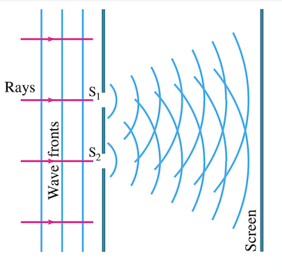

# Physics Waves
Notes for grade 12

---

Here are some of the notes that I have for the waves unit in markdown.


Completion List:
--
* [ ] Exam Prep

- [Physics Waves](#physics-waves)
  - [Completion List:](#completion-list)
      - [Lectures:](#lectures)
      - [Readings:](#readings)
      - [Important Equations](#important-equations)
  - [Topics for waves](#topics-for-waves)
      - [Major topics](#major-topics)
      - [Supplemental topics](#supplemental-topics)
- [Expansion into Major topics](#expansion-into-major-topics)
  - [Major assumptions](#major-assumptions)
    - [Properties of Waves and Light](#properties-of-waves-and-light)
      - [Section summary:](#section-summary)
    - [Refraction and total internal reflection](#refraction-and-total-internal-reflection)
      - [Snell's law](#snells-law)
      - [Explanation of Snell's Law](#explanation-of-snells-law)
      - [Total internal reflection](#total-internal-reflection)
      - [Section summary](#section-summary-1)
    - [Rainbows \& Dispersion](#rainbows--dispersion)
    - [Interference of waves](#interference-of-waves)
    - [Properties of Diffraction](#properties-of-diffraction)

#### Lectures:
- [ ] 802 Lecture 26: Travelling waves, Standing waves 
  - [ ] Lecture 26 notes
  - [ ] **Allotted time: 2 hours; Difficulty: 1**
- [ ] 803 Lecture 8: Travelling waves in detail
  - [ ] Listen
  - [ ] **Allotted time: 1.3 hours; Difficulty: 1.5**
- [ ] 802 Lecture 27: Destructive Resonance
  - [ ] Lecture 27 notes
  - [ ] **Allotted time: 1.2 hours; Difficulty 2**
- [ ] 802 Lecture 28: Polarization 
  - [ ] Lecture 28 notes - *Polarization biased*
  - [ ] **Allotted time: 1.5 hours; Difficulty 2**
- [ ] 802 Lecture 29: Snell's Law, Index of Refraction, Huygen's Principle
  - [ ] Lecture 29 notes - High priority
  - [ ] **Allotted time: 1 hours; Difficulty 2**
- [ ] 803 Lecture 18: Index of Refraction, Reflection, Brewster's Angle
  - [ ] Lecture 18 notes - High priority 2, high time consumption
  - [ ] **Allotted time: 2 hours; Difficulty 3**
- [ ] 802 Lecture 30: Polarizers continued, Malus' Law, Light Scattering
  - [ ] Lecture 30 notes - High priority
  - [ ] **Allotted time: 1 hours; Difficulty 1.7**
- [ ] 802 Lecture 31: Rainbows and light scattering 
  - [ ] Lecture 31 notes - Mostly conceptual; Light prisms 
  - [ ] **Allotted time: 1.5 hours; Difficulty 1.3**
- [ ] 803 Lecture 20: Interference, Huygen's Principle, Thin films
  - [ ] Lecture 20 notes - High priority
  - [ ] **Allotted time: 1.3 hours; Difficulty 2.2**
- [ ] 802 Lecture 33: Double-slit interference
  - [ ] Lecture 33 notes - High priority
  - [ ] **Allotted time: 1 hours; Difficulty 1**
- [ ] 802 Lecture 34: Diffraction, Gratings, Angular resolution
  - [ ] Lecture 34 notes - High priority
  - [ ] **Allotted time: 3 hours; Difficulty 3**
- [ ] 803 Lecture 21 Diffraction Gratings
  - [ ] **Allotted time: 1.3 hours; Difficulty 2**
  - [ ] Listen
- [ ] 803 Lecture 22 - Demos

#### Readings:
Book: Giancoli Physics Principles 7th edition
- [ ] Chapter 22 - **Waves** - Page 625-639 (good reading for introductory knowledge)
- [ ] Chapter 23 - **Light, Geometric Optics** - Page 644-667 {not **that** important other than 23.1}
- [ ] Chapter 24 - **Wave nature of Light** - Page 679-702 {Very important, 24.1-24.10}
- [ ] Try questions on **Page** 708; 9-11; 18-20; 25-28 **Page** 711; 80,81,91
- [ ] Chapter 25 - **Optical instruments** - Page 713 {Quite important, especially 25.1 and 25.8}
- [ ] Chapter 26 - **Special theory of relativity** - Page 744- {SUPER important; 26.1-26.10; Be very careful with this chapter}


---

#### Important Equations

**Basic wave equation:** 
$a \sin (\omega t - kx + \phi)$

**Wave number, $k$:**
$k = \frac{2\pi}{\lambda}$

**Wavelength:**
$v = f\lambda$

**Angular frequency (_super important_):**
$T = period$

$\omega = \frac{2\pi}{T}=2\pi f$

**Snell's Law**
$n_1 =$ incident index (from the normal)
$n_2 =$ refracted index (from the normal)
$$\frac{n_2}{n_1} = \frac{sin \theta_1}{sin \theta_2} = \frac{v_1}{v_2} = \frac{\lambda_1}{\lambda_2}$$
**Path differences**


## Topics for waves
#### Major topics
* [ ] Properties of Waves and light
  * [ ] Travelling waves & its properties
  * [ ] Standing waves & nodes
* [ ] Refraction and total internal reflection
  * [ ] Huygen's principle and Snell's law
  * [ ] Total internal reflection
* [ ] Rainbows & Dispersion
* [ ] Diffraction, Constructive and destructive interference
  * [ ] Young's double slit experiment
  * [ ] Half length difference
  * [ ] Single slit diffraction
* [ ] Diffraction grating
* [ ] Polarization and Malus's Law
  * [ ] Polarization
  * [ ] Brewster's angle
* [ ] Mechanical waves

#### Supplemental topics
* [ ] Mechanical waves
* [ ] Sound waves and instruments
* [ ] Fluctuation in matter


---

# Expansion into Major topics

## Major assumptions
Quite important to think about, so you don't **lose your mind** when you hear $sin(\theta) = \theta$ in approximation.

Small angle radian approximation:
$$sin(\theta) = \theta $$
$$tan(\theta) = \sin(\theta) $$


### Properties of Waves and Light

**Travelling waves** and its properties first.

A travelling wave is obviously a wave travelling. Some things to remember about this is that if we want something to move in the $+x$ direction, we can simply replace the $x$ with a $ x-vt $. 


**Standing waves** are not **that** different, except for one important thing. This is that the **nodes** on a standing wave are... well standing. They don't move, unlike in a travelling wave, where the wave amp doesn't fluctuate, it is the entire wave travelling.
A **node** is a point on the wave where y is always 0, it is positioned at half a period.

#### Section summary:
Travelling waves have non-stationary nodes, and "shift". Standing waves oscillate around the nodes, thus at 1/4 of a period it will be a straight line.

**Uniform formula:**

$$ y = a sin (kx - \omega t) $$

**Opposite direction "collision" formula**

$$ for:y_1=y_0 sin(kx-\omega t) \space \& \space y_2 = y_0 sin(kx+\omega t) $$

$$ y=y_1+y_2=2y_0 sin(kx)cos(\omega t) $$

> :bulb: Since both are sin graphs, they start at the maximum, or y<sub>0</sub>, thus amplitude = y<sub>0</sub>
> $\omega$ can also be interpreted as the angular speed, but $v=\omega * amp$
> two travelling waves in opposite directions result in a standing wave
>
*Nicely about this combined equation is that the spacial stuff is isolated in the left part, allowing for quick findings of the nodes*
### Refraction and total internal reflection

Starting with **Huygen's Principle**. This is essentially a theoretical concept to help visualize waves travelling around objects. You will often see reference to something called a "Huygen source". This is a source where spherical waves propagate from.



*S1 and S2 are both Huygen sources*
> This is less important than the ray & wave model that we use for reflection and refraction. 

#### Snell's law
So we start with **Snell's law**, where the angle actually matters. 
If you have a light going from one medium to another medium with a different density, the speed **changes**, and so does the angle.
As an example, if you shine light into water, the light "slows down" and bends towards the normal. 

The **index of refraction** is provided as:
$$n = \frac{c}{v} \space \therefore v= \frac{c}{n}$$
>The index of refraction is how much slower the light is when compared to the speed of light in a vacum, c. 


The equation here is summarized as:
$$ n_1 sin(\theta_1) =n_2 sin(\theta_2) $$
Therefore:
$$ \frac{n_1}{n_2} = \frac{sin\theta_2}{sin\theta_1} = \frac{v_2}{v_1}$$

#### Explanation of Snell's Law
So these aren't really rays that "hit" the medium, but rather waves that do. I'll do a quick summary of the explanation here, but if you want to read it, it is available on Page 681.

**Anyways, look at the graph below:**


Understanding this diagram shouldn't be that bad, where the blue represents the waves, which gets "bent" when they pass the medium.

With some geometry thinking, it shouldn't be too hard to realize that $\color{red}\angle BAD$ and $\color{blue}\angle ADC$ represent $\color{red}\theta_1$ and $\color{blue}\theta_2$ respectively.
So we can see that AD is the **hypotnuse** for both "triangles", where the **opposite** for each is defined as $vt$; don't worry, t cancels out.

So since $sin = Opposite/hypotnuse$:

$$sin({\color{red}\theta_1})= \frac{v_1t}{AD};sin({\color{blue}\theta_2}= \frac{v_2t}{AD})$$

Hence:

$$\frac{sin({\color{red}\theta_1})}{sin({\color{blue}\theta_2})}=\frac{v_1t}{v_2t}= \frac{v_1}{v_2}$$

Conclusively speaking:

$$\frac{n_2}{n_1} = \frac{v_1}{v_2} = \frac{\lambda_1}{\lambda_2} $$

**Now moving on to some stuff where the angle doesn't really matter:**


> In terms of reflection and refraction, when light reflects off a **denser** surface, the phase **Flips**; when the light passes through the surface, the phase **stays the same**; when the light reflects off a less dense surface, the phase **stays the same**;
> When n<sub>2</sub> is denser than n<sub>1</sub>, phase of AD **flips**; When n<sub>3</sub> is less dense than n<sub>2</sub>, phase of AD **remains the same**; vice versa.
> Rays that **pass through**, such as AD, **do not change phase**

This may sound a little confusing, because it is, but just remember this: When a ray hits some medium, and it is denser, phase change happens to the reflected light. Thats it. 
We will revisit what happens to the reflected light and why you may see rainbows in interference.

#### Total internal reflection

So we just saw that refraction is when the light passes through. Now reflection. But with a twist. So there are certain angles of incidence where the light completely reflects, and there is no refracted light. 

This situation is called total internal reflection, and the reason that it is called internal reflection is that the light source is inside the medium. 
An example shows light trying to escape the water.


So the angle where this K situation happens is called critical angle. Since we know $n_1 sin(\theta_1) = n_2 sin(\theta_2)$, we can find the critical angle by using $\theta_2 = 90\degree$. 
Conclusively we get:
$$\theta_1 = \arcsin(\frac{n_2}{n_1})$$

#### Section summary
Covers, snell's law, huygen's principle, and reflection and refraction. 

**Critical formulas:**

### Rainbows & Dispersion

Somewhat of an interesting topic.
The most important part about rainbows is just that "white" light, is actually just a mixture of light with different wavelengths. 
When this mixture of light light is **refracted**, they all have different angles of refraction, since $sin\theta$ is kind of proportional to the wavelength. 


### Interference of waves
To be fair this is really quite hard to understand, but I will try my best.
Something basic to start with is constructive and destructive interference.
> **Concept to remember:** 
> If two waves hit the source at the same phase, they form a higher bump, if they are 180deg out of phase, they kill each other, forming darkness.
> **Interference** is how you get light+light equals darkness


In the double slit interference experiment, we can get the **path length difference formula**. Something super important is the small angle approximation.
Further expansion on this...


### Properties of Diffraction
Also difficult to understand, but uses the same formula as double slit interference.


uh some testing with markdown
```diff
- text in red
+ text in green
! text in orange
# text in gray
@@ text in purple (and bold)@@
```

```diff```